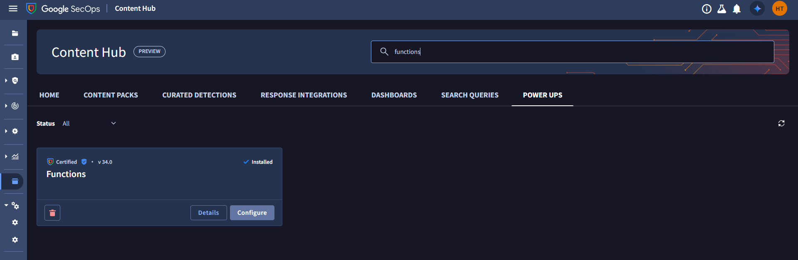
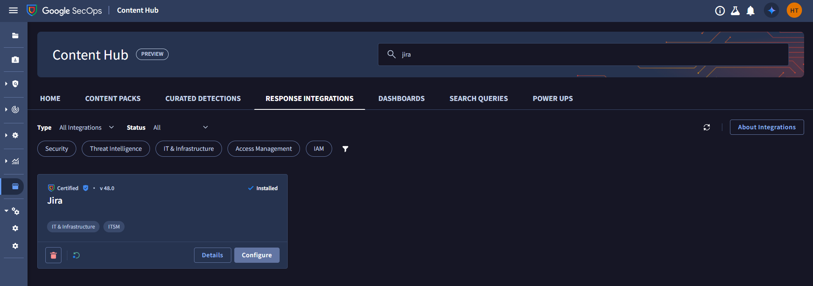

# Cyware Intel Exchange Google SecOps Playbooks

This repository contains sample playbooks that use the **Cyware Intel Exchange** integration in **Google SecOps SOAR** platform. These playbooks automate threat intelligence management, IOC classification, risk-based decision making, and incident tracking using Cyware Intel Exchange data, enabling rapid and comprehensive insights for security operations.

These playbooks can be used as a reference to generate a custom workflow to fulfill your needs.

## Import Playbooks

Importing a playbook into any SecOps instance is straightforward:

- Download the `.zip` file of the playbook that needs to be imported. This file would also contain all the blocks that are used in the playbook.

  

- Open the SecOps instance. From the sidebar, navigate to **Response > Playbooks** section.

  

- Click on the **three dots** icon at the top of the Playbooks, and then click on **Import**.

  

- Select the `.zip` file downloaded earlier.

The playbooks stored in the file would be imported. We can access these under the **Imported Playbooks** folder. These playbooks and blocks can be moved to any other folder of our choice.

You can also download the [**All Playbook Bundle**](<./Cyware Intel Exchange All Playbooks.zip>) which includes all the Cyware Intel Exchange playbooks and blocks.

**Important:** Before using any playbook with an alert, review its default settings (triggers, action parameters, etc.) to ensure they align with your needs.

---

## Install other utilities for playbooks

- Go to **Content Hub**.

  

- Click on **Power-Ups**.

  

- Search for **Functions** and click on **Install**.

  

- Configure **Functions** by clicking on the **Configure** button.

  

- Go to **Response Integrations**

- Search for **Siemplify** and click on **Install**.

  

- Configure **Siemplify**.

  

- Search for **Jira** and click on **Install**.

  

- Configure **Jira**.

  

---

## Documentation

- [Playbooks](#playbooks)
  - [Add-Remove IOC from Allowed List](#add-remove-ioc-from-allowed-list)
  - [Create IOCs on Cyware Intel Exchange](#create-iocs-on-cyware-intel-exchange)
  - [Manual IOC - JIRA Issue Creation](#manual-ioc---jira-issue-creation)
  - [Dynamic Tags Classification on IOCs](#dynamic-tags-classification-on-iocs)
- [Blocks](#blocks)
  - [Add-Remove IOC from Allowed List Block](#add-remove-ioc-from-allowed-list-block)
  - [Manual IOC - JIRA Issue Creation Input Block](#manual-ioc---jira-issue-creation-input-block)
- [Troubleshooting](#troubleshooting)

---

## Playbooks

Playbooks are a feature in Google Security Operations (SecOps) that can be used to automatically perform actions on alerts/cases when triggered. Playbooks can be used to: Retrieve information about alerts, Remediate threats, Create tickets, and Manage toxic combinations and IAM recommendations.

**Points to Note:**

- `.zip` file for every playbook contains the playbook along with all the blocks used in that playbook.
- Each playbook requires a trigger, which decides when the playbook would be run. Users can update the Trigger conditions based on the requirements.
- The imported playbooks are disabled by default. User can easily enable any playbook by simply clicking on the toggle button beside the playbook name. ([Reference](https://cloud.google.com/chronicle/docs/soar/respond/working-with-playbooks/whats-on-the-playbooks-screen#:~:text=At%20the%20top%20segment%20of%20the%20playbook%20designer%20pane%2C%20you%20can%20use%20the%20horizontal%20toggling%20button%20to%20enable%20or%20disable%20the%20playbook.))

---

### Add-Remove IOC from Allowed List

This playbook automatically manages IOCs across security controls based on threat confidence levels. It removes high-confidence threats from allowed lists and adds low-risk IOCs to allowed lists for optimized security posture. [Download](<./playbooks/Add-Remove IOC from Allowed List.zip>)

**Supported IOC Types:**

- IPV4
- IPV6
- Domain
- URL
- Email

**Usecase:**

This playbook automatically removes IOCs present in case of high confidence— including IPs, domains, URLs, and Emails—from allowed lists across security controls when a high-confidence threat is identified with a confidence score greater than 69 and adds it to allowed List if the confidence score is less than 30.

**Actions in Use:**

1. **Get IOC Details**
   - Extracts IOC details including confidence scores from Cyware Intel Exchange using the Bulk IOC endpoint.

2. **Remove IOCs from Allowed list**
   - Based on the IOC value received from the previous action, this action removes the IOC from the allowed list if the confidence score is greater than 69.

3. **Add IOCs to Allowed list**
   - Adds IOCs to the allowed IOC list if the confidence score is less than 30, since the IOC has low risk.

**Flow:**

- **Add-Remove IOC from Allowed List Block**
  - Collects entity information from the alert and processes IOCs based on confidence scores.
- **Get IOC Details (action)**
  - Retrieves detailed information about IOCs including confidence scores using the Bulk IOC endpoint.

- **Check IOC exists**
  -  If IOC is not returned by the bulk IOC endpoint, a comment will be added that IOC is not exists on Cyware Intel Exchange.
  - If an unsupported IOC type is provided, a comment will be added in the case clarifying that the IOC type is not supported for this playbook.

- **Conditional Processing**
  - **High Risk (confidence_score > 69):** Removes IOCs from allowed lists. A comment will be added in case for that.
  - **Medium Risk (30 <= confidence_score <= 69):** No action is taken. A comment will be added in case for that IOC has not been added in allowed list.
  - **Low Risk (confidence_score < 30):** Adds IOCs to allowed lists. A comment will be added with the following possible outcomes:
    - **Added:** IOC is added to allowed list on Cyware Intel Exchange.
    - **In Valid:** IOC is invalid to add in allowed list on Cyware Intel Exchange.
    - **Already Exists:** IOC already exists in allowed list on Cyware Intel Exchange.

---

### Create IOCs on Cyware Intel Exchange

This playbook is designed to automatically create IOCs on the Cyware platform that are not already present, ensuring comprehensive threat intelligence coverage. [Download](<./playbooks/Create IOCs on Cyware  Intel Exchange.zip>)

**Supported IOC Types:**

- IPV4
- IPV6
- Domain
- URL
- Email

**Usecase:**

This playbook creates IOCs not present on the Cyware platform by checking the IOC exists or not from the Bulk IOC endpoint response.

**Actions in Use:**

1. **Get IOC Details**
   - Extracts the IOC details from Cyware Intel Exchange for every IOC using the Bulk IOC endpoint.

2. **Create Intel in Cyware Intel Exchange**
   - Creates an IOC on the Cyware Intel Exchange platform.

**Flow:**

- **Entity Collection**
  - Gathers all entities (IPs, domains, URLs, emails) from the case and iterate over each.

- **Get IOC Details (action)**
  - Retrieves detailed information about IOCs including confidence scores using the Bulk IOC endpoint.

- **Check IOC exists**
  - Identifies IOCs that don't exists in the response, meaning they don't exist in Cyware Intel Exchange.So, It will be created. If IOC is returned by the bulk IOC endpoint, a comment will be added that IOC already exists on Cyware Intel Exchange. So, IOC will not be created.
  - If an unsupported IOC type is provided, a comment will be added in the case clarifying that the IOC type is not supported for this playbook.

- **Create Intel in Cyware Intel Exchange (action)**
  - Creates new IOC entries on the Cyware platform for missing IOCs.

---

### Manual IOC - JIRA Issue Creation

This playbook automates the creation of Jira tickets for high-confidence IOCs that require manual review, streamlining the analyst workflow. [Download](<./playbooks/Manual IOC - JIRA Issue Creation.zip>)

**Usecase:**

This playbook triggers the creation of a Jira ticket for IOCs where `manual_review` is set as true and the `confidence_score` from the Bulk IOC endpoint is greater than 69.

**Actions in Use:**

1. **Get IOC Details**
   - Retrieves IOC fields from Cyware Intel Exchange including the specified "IOC fields" from input along with id, confidence_score, name, and manual_review.

2. **Create Jira Issue**
   - Generates a Jira ticket with the specified project key containing:
    - IOC ID
    - IOC Value

**Flow:**

- **Manual IOC - JIRA Issue Creation Input Block**
  - Collects entity information and prepares data for Jira ticket creation.

- **Get IOC Details (action)**
  - Retrieves IOC fields from Cyware Intel Exchange including the specified "IOC fields" from input along with id, confidence_score, name, and manual_review.

- **Check Condition**
  - Identifies IOCs where:
    - `manual_review` = true
    - `confidence_score` > 69

- **Create Jira Issue (action)**
  - Generates a Jira ticket with the specified project key containing:
    - IOC ID
    - IOC Value

---

### Dynamic Tags Classification on IOCs

This playbook ensures that IOCs are automatically categorized using Cyware tag names in the Cyware Intel Exchange platform to enable structured threat intelligence management and enhanced reporting. [Download](<./playbooks/Dynamic Tags Classification on IOCs.zip>)

**Usecase:**

This playbook categorizes and tags IOCs based on their confidence scores, enabling better organization and risk-based filtering in Cyware Intel Exchange.

**Confidence Score Ranges and Tags:**

| Confidence Score Range | Tag                         |
| ---------------------- | --------------------------- |
| 1-29                   | Low Risk - Google SecOps    |
| 30-69                  | Medium Risk - Google SecOps |
| > 69                   | High Risk - Google SecOps   |
| 0                      | No Tag will be added        |

**Actions in Use:**

1. **Get IOC Details**
   - Extracts the IOC details including `id` and `confidence_score` from Cyware for every IOC.

2. **Add Tags to IOC**
   - Adds the appropriate risk-based tags to the IOCs based on their confidence scores.

**Flow:**

- **Entity Collection**
  - Gathers all entities from the case.

- **Get IOC Details (action)**
  - Retrieves detailed information about IOCs including confidence scores using the Bulk IOC endpoint. If IOC is not returned by the bulk IOC endpoint, a comment will be added that IOC is not exists on Cyware Intel Exchange.

- **Tag Classification Logic**
  - **Low Risk (1 ≤ confidence_score ≤ 29):** Assigns "Low Risk - Google SecOps" tag
  - **Medium Risk (30 ≤ confidence_score ≤ 69):** Assigns "Medium Risk - Google SecOps" tag
  - **High Risk (confidence_score > 69):** Assigns "High Risk - Google SecOps" tag
  - **No Tag will be added (confidence_score = 0):** No tag will be added

- **Add Tags to IOC (action)**
  - Applies the classified tags to IOCs in Cyware Intel Exchange.

---

## Blocks

A block is a re-usable set of actions and conditions that can be used in multiple playbooks. This acts as a wrapper for performing some set of actions that are often performed in multiple playbooks.

---

### Add-Remove IOC from Allowed List Block

This block manages the logic for adding or removing IOCs from allowed lists based on confidence scores. [Download](<./blocks/Add-Remove IOC from Allowed List Block.zip>)

**Input:**

- IOC Value
- IOC type (IPV4, IPV6, Domain, URL, Email)
- Confidence score

**Flow:**

- **Check Confidence Score**
  - - **Conditional Processing**
  - **High Risk (confidence_score > 69):** Removes IOCs from allowed lists. A comment will be added in case for that.
  - **Medium Risk (30 <= confidence_score <= 69):** No action is taken. A comment will be added in case for that IOC has not been added in allowed list.
  - **Low Risk (confidence_score < 30):** Adds IOCs to allowed lists. A comment will be added with the following possible outcomes:
    - **Added:** IOC is added to allowed list on Cyware Intel Exchange.
    - **In Valid:** IOC is invalid to add in allowed list on Cyware Intel Exchange.
    - **Already Exists:** IOC already exists in allowed list on Cyware Intel Exchange.

- **Remove IOCs from Allowed list (action)**
  - Based on the IOC value received from the previous action, this action removes the IOC from the allowed list if the confidence score is greater than 69.

- **Add IOCs to Allowed list (action)**
  - Adds IOCs to the allowed IOC list if the confidence score is less than 30, since the IOC has low risk.

**Output:**

- A comment will be added in Case.

---

### Manual IOC - JIRA Issue Creation Input Block

This block collects and prepares input data for creating Jira tickets for IOCs requiring manual review. [Download](<./blocks/Manual IOC - JIRA Issue Creation Input Block.zip>)

**Input:**

- **IOC fields**: IOC fields to retrieve from get IOC details. By default it will fetch id, confidence_score, name, manual_review.
- **Jira Project Key**: Project key to create on Jira.

**Flow:**

- **Extract Input Params (action)**
  - This action collects the input values and convert it to JSON, which is then used in other actions.

**Output:**

- Returns the generated `JSON output` containing all the input values.

---

## Troubleshooting

In case of any failures when running any playbook, we can debug the same by running the playbook in the Simulator Mode. For more details, please refer to this guide: [Google SecOps playbooks - Simulator](https://cloud.google.com/chronicle/docs/soar/respond/working-with-playbooks/working-with-playbook-simulator).

---

## References

- [Cyware Intel Exchange Documentation](https://ctixapiv3.cyware.com/intel-exchange-api-reference/intel-exchange-api-reference)
- [Google SecOps Playbooks Documentation](https://cloud.google.com/chronicle/docs/secops/google-secops-soar-toc#work-with-playbooks)

---

For questions or support, please contact your Cyware or Google SecOps administrator.
